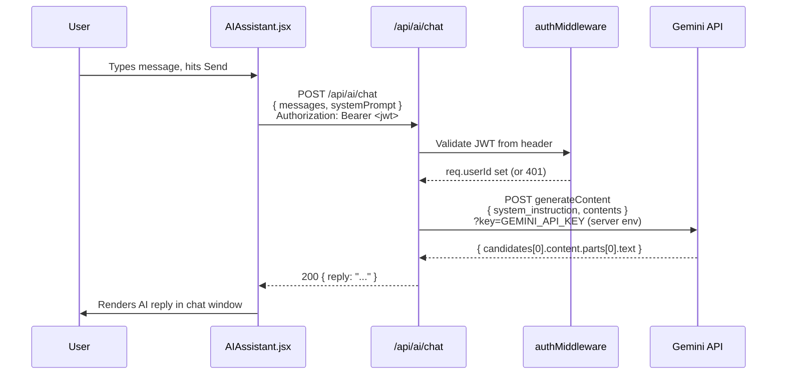
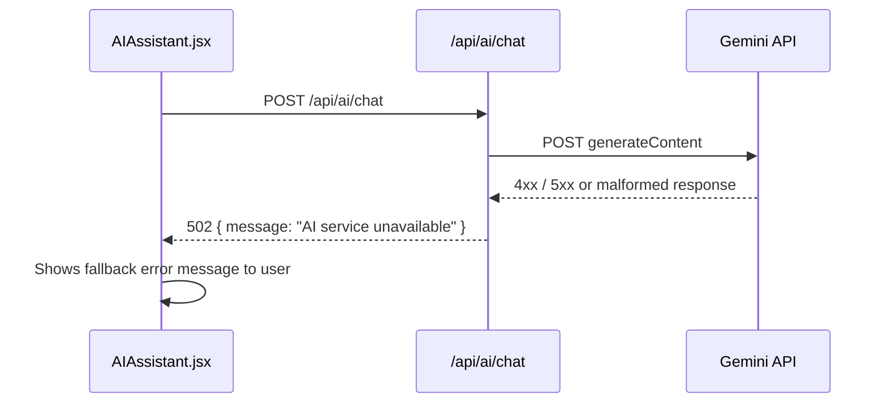

# Design Document: AI Assistant Backend Proxy

## Overview

Move the Gemini AI API calls from the React frontend (`AIAssistant.jsx`) to a secure Express backend endpoint (`/api/ai/chat`). The frontend will call the backend proxy instead of hitting the Gemini API directly, keeping the `GEMINI_API_KEY` off the client bundle entirely.

This eliminates the 400 error caused by the exposed `VITE_GEMINI_API_KEY` and follows the same pattern already established by `/api/email` and `/api/auth` routes.

---

## Architecture

```mermaid
graph TD
    A[AIAssistant.jsx<br/>React Frontend] -->|POST /api/ai/chat<br/>Bearer JWT| B[Express Backend<br/>backend/server.js]
    B --> C[authMiddleware<br/>Validates JWT]
    C --> D[ai.js Route Handler<br/>backend/routes/ai.js]
    D -->|POST with GEMINI_API_KEY<br/>server-side only| E[Gemini 2.0 Flash API<br/>generativelanguage.googleapis.com]
    E -->|candidates[0].content| D
    D -->|{ reply: string }| A

    style E fill:#4285F4,color:#fff
    style B fill:#68A063,color:#fff
    style A fill:#61DAFB,color:#000
```

---

## Sequence Diagrams

### Happy Path: User Sends a Message



### Error Path: Gemini API Failure



---

## Components and Interfaces

### Component 1: `backend/routes/ai.js` (New)

**Purpose**: Receives chat requests from the frontend, forwards them to Gemini with the server-side API key, and returns the text reply.

**Interface**:
```
POST /api/ai/chat
Authorization: Bearer <jwt>
Content-Type: application/json

Request Body:
{
  messages: Array<{ role: "user" | "model", parts: [{ text: string }] }>,
  systemPrompt?: string   // optional override; defaults to server-side constant
}

Response 200:
{
  reply: string
}

Response 400:
{
  message: "messages array is required"
}

Response 401:
{
  message: "No token provided" | "Invalid token"
}

Response 502:
{
  message: "AI service unavailable"
}
```

**Responsibilities**:
- Validate request body (`messages` is a non-empty array)
- Enforce JWT auth via `authMiddleware`
- Call Gemini API using `GEMINI_API_KEY` from `process.env` (never exposed to client)
- Extract `candidates[0].content.parts[0].text` from Gemini response
- Return `{ reply }` or appropriate error

---

### Component 2: `src/components/AIAssistant.jsx` (Modified)

**Purpose**: Replace the direct `callGemini()` fetch with a call to the backend proxy via the existing `api.js` helper.

**Interface change**:
```
// REMOVE
const GEMINI_API_KEY = import.meta.env.VITE_GEMINI_API_KEY
async function callGemini(messages) { fetch('https://generativelanguage...') }

// ADD
async function callAI(messages) { api.chatAI(messages) }
```

**Responsibilities**:
- Remove all direct Gemini API references
- Remove `VITE_GEMINI_API_KEY` usage
- Call `api.chatAI(messages)` and read `response.reply`
- Keep all existing UI/UX logic unchanged

---

### Component 3: `src/lib/api.js` (Modified)

**Purpose**: Add `chatAI` method to the existing `api` object.

**Interface addition**:
```javascript
chatAI: (messages) =>
  request('/ai/chat', { method: 'POST', body: JSON.stringify({ messages }) })
```

---

### Component 4: `backend/server.js` (Modified)

**Purpose**: Register the new AI route.

**Addition**:
```javascript
const aiRoutes = require('./routes/ai')
app.use('/api/ai', aiRoutes)
```

---

## Data Models

### ChatMessage (shared shape)

```
{
  role: "user" | "model",   // Gemini's expected role field
  parts: [{ text: string }] // Gemini's expected parts format
}
```

### AIAssistant internal message (frontend only)

```
{
  from: "user" | "ai",  // used for UI rendering
  text: string
}
```

The frontend maps `from: "ai"` → `role: "model"` before sending to the backend.

---

## Key Functions with Formal Specifications

### `POST /api/ai/chat` handler

**Preconditions:**
- `req.headers.authorization` contains a valid `Bearer <jwt>` token
- `req.body.messages` is a non-empty array of `ChatMessage` objects
- `process.env.GEMINI_API_KEY` is set on the server

**Postconditions:**
- On success: responds `200` with `{ reply: string }` where `reply` is non-empty
- On missing/invalid body: responds `400`
- On auth failure: responds `401` (handled by middleware before handler runs)
- On Gemini error: responds `502` with `{ message: "AI service unavailable" }`
- `GEMINI_API_KEY` is never included in any response body

**Loop Invariants:** N/A (no loops in handler)

---

### `callAI(messages)` in AIAssistant.jsx

**Preconditions:**
- `messages` is a non-empty array with at least one `{ role: "user" }` entry
- `localStorage.getItem('af_token')` returns a valid JWT (user is logged in)

**Postconditions:**
- Returns `string` reply on success
- Throws `Error` on non-2xx response (caught by existing `try/catch` in `sendMessage`)

---

## Algorithmic Pseudocode

### Backend Route Handler

```pascal
PROCEDURE handleAIChat(req, res)
  INPUT: req (HTTP request with JWT header and body)
  OUTPUT: HTTP response

  SEQUENCE
    // authMiddleware already ran; req.userId is set
    
    messages ← req.body.messages
    
    IF messages IS NULL OR messages.length = 0 THEN
      RETURN res.status(400).json({ message: "messages array is required" })
    END IF

    geminiPayload ← {
      system_instruction: { parts: [{ text: SYSTEM_PROMPT }] },
      contents: messages,
      generationConfig: { maxOutputTokens: 500, temperature: 0.7 }
    }

    TRY
      geminiRes ← await fetch(GEMINI_ENDPOINT + "?key=" + process.env.GEMINI_API_KEY, {
        method: "POST",
        headers: { "Content-Type": "application/json" },
        body: JSON.stringify(geminiPayload)
      })

      data ← await geminiRes.json()

      reply ← data.candidates[0].content.parts[0].text

      IF reply IS NULL OR reply IS EMPTY THEN
        THROW Error("Empty response from Gemini")
      END IF

      RETURN res.status(200).json({ reply })

    CATCH error
      console.error(error)
      RETURN res.status(502).json({ message: "AI service unavailable" })
    END TRY
  END SEQUENCE
END PROCEDURE
```

### Frontend `callAI` Replacement

```pascal
PROCEDURE callAI(messages)
  INPUT: messages — Array of { from: "user"|"ai", text: string }
  OUTPUT: string (AI reply text)

  SEQUENCE
    // Map internal format to Gemini role format
    contents ← messages.map(m → {
      role: IF m.from = "user" THEN "user" ELSE "model",
      parts: [{ text: m.text }]
    })

    response ← await api.chatAI(contents)

    RETURN response.reply
  END SEQUENCE
END PROCEDURE
```

---

## Example Usage

```javascript
// Frontend: AIAssistant.jsx (after change)
const reply = await callAI(historyForApi)
// reply is a plain string — no change to downstream rendering logic

// Backend: curl test
// curl -X POST https://autoflow-backend.vercel.app/api/ai/chat \
//   -H "Authorization: Bearer <token>" \
//   -H "Content-Type: application/json" \
//   -d '{"messages":[{"role":"user","parts":[{"text":"Hello"}]}]}'
// → { "reply": "Namaste! Main AutoflowPilot Assistant hoon..." }
```

---

## Correctness Properties

*A property is a characteristic or behavior that should hold true across all valid executions of a system — essentially, a formal statement about what the system should do. Properties serve as the bridge between human-readable specifications and machine-verifiable correctness guarantees.*

### Property 1: Valid request produces non-empty reply

*For any* non-empty array of valid `ChatMessage` objects sent with a valid JWT, when the Gemini API returns a successful response, the Proxy_Route responds with HTTP 200 and a `reply` field that is a non-empty string equal to `candidates[0].content.parts[0].text`.

**Validates: Requirements 1.1, 1.2, 1.3**

### Property 2: Invalid messages body returns 400

*For any* request body where `messages` is `null`, `undefined`, or an empty array `[]`, the Proxy_Route responds with HTTP 400 and `{ message: "messages array is required" }`.

**Validates: Requirements 1.4**

### Property 3: Gemini failure always returns 502

*For any* Gemini API failure mode — network error, 4xx/5xx status, or malformed response missing `candidates[0].content.parts[0].text` — the Proxy_Route responds with HTTP 502 and `{ message: "AI service unavailable" }` and never propagates the raw Gemini error to the client.

**Validates: Requirements 1.5, 6.3**

### Property 4: API key never leaks in responses

*For any* request (valid, invalid, authenticated, or unauthenticated), the serialized HTTP response body and headers never contain the value of `process.env.GEMINI_API_KEY`.

**Validates: Requirements 1.6, 6.1**

### Property 5: Missing JWT returns 401

*For any* request to `/api/ai/chat` that does not include an `Authorization` header, the Auth_Middleware responds with HTTP 401 and `{ message: "No token provided" }` before the route handler executes.

**Validates: Requirements 2.2**

### Property 6: Invalid JWT returns 401

*For any* string that is not a valid JWT signed with `JWT_SECRET`, when supplied as the Bearer token, the Auth_Middleware responds with HTTP 401 and `{ message: "Invalid token" }` before the route handler executes.

**Validates: Requirements 2.3**

### Property 7: Valid JWT sets req.userId

*For any* valid JWT containing a `userId` claim, after Auth_Middleware runs, `req.userId` equals the decoded `userId` and `next()` is called to allow the handler to proceed.

**Validates: Requirements 2.4**

### Property 8: chatAI sends correct request shape

*For any* messages array, calling `api.chatAI(messages)` produces a `POST` request to `/ai/chat` with a JSON body of `{ messages }` and an `Authorization: Bearer <token>` header matching the token in `localStorage`.

**Validates: Requirements 4.1, 4.3**

### Property 9: chatAI throws on non-2xx response

*For any* non-2xx HTTP response from the backend, `api.chatAI` throws an `Error` whose message matches the response body's `message` field.

**Validates: Requirements 4.2**

### Property 10: Internal message format maps correctly to ChatMessage

*For any* array of internal AIAssistant messages `{ from: "user"|"ai", text: string }`, the mapping function produces a `ChatMessage` array where `from: "user"` maps to `role: "user"` and `from: "ai"` maps to `role: "model"`, with `parts: [{ text }]` preserved.

**Validates: Requirements 5.3**

### Property 11: api.chatAI errors are caught and shown as fallback

*For any* error thrown by `api.chatAI`, the AIAssistant component catches it, appends the fallback error message to the chat, and does not crash or leave the typing indicator active.

**Validates: Requirements 5.4**

---

## Error Handling

### Scenario 1: Missing JWT

**Condition**: Request arrives without `Authorization` header  
**Response**: `authMiddleware` returns `401 { message: "No token provided" }` before the handler runs  
**Recovery**: Frontend `api.js` throws, caught by `sendMessage` try/catch, shows fallback message

### Scenario 2: Gemini API Key Invalid / Quota Exceeded

**Condition**: Gemini returns 400 or 429  
**Response**: Handler catches, returns `502 { message: "AI service unavailable" }`  
**Recovery**: Frontend shows "Kuch error aa gayi. Thodi der baad try karo."

### Scenario 3: Malformed Gemini Response

**Condition**: `candidates[0].content.parts[0].text` is undefined  
**Response**: Handler throws inside try/catch, returns `502`  
**Recovery**: Same as Scenario 2

### Scenario 4: Empty `messages` Array

**Condition**: Frontend sends `{ messages: [] }`  
**Response**: Handler returns `400 { message: "messages array is required" }`  
**Recovery**: Frontend shows fallback error message

---

## Testing Strategy

### Unit Testing

- Test route handler with mocked `fetch` (Gemini call): valid input → 200 with reply
- Test route handler: empty messages → 400
- Test route handler: Gemini throws → 502
- Test `authMiddleware`: missing token → 401, valid token → calls next()

### Property-Based Testing

**Property Test Library**: fast-check

- For any non-empty array of valid `ChatMessage` objects, the handler either returns `{ reply: string }` or a structured error — never an unhandled exception.
- For any input, `GEMINI_API_KEY` value never appears in the serialized response.

### Integration Testing

- End-to-end: authenticated POST to `/api/ai/chat` with a real message returns a non-empty `reply` string.
- Verify `VITE_GEMINI_API_KEY` is absent from the Vite production bundle (`dist/`) after the frontend change.

---

## Security Considerations

- `GEMINI_API_KEY` moves from `VITE_*` (bundled into client JS) to `process.env` on the server (never sent to browser).
- The endpoint is protected by `authMiddleware` — anonymous callers cannot use the AI feature and rack up API costs.
- Rate limiting should be considered in a follow-up (e.g., per-user request throttling) to prevent abuse by authenticated users.
- The system prompt (`SYSTEM_PROMPT`) moves to the server, preventing users from inspecting or overriding it via browser devtools.

---

## Performance Considerations

- Gemini `generateContent` is a synchronous request/response (no streaming). Latency is typically 1–3 seconds — acceptable for a chat widget.
- No caching needed at this stage; each message is context-dependent.
- The backend is deployed on Vercel serverless functions; cold starts are possible but negligible for this use case.

---

## Dependencies

| Dependency | Location | Purpose |
|---|---|---|
| `node-fetch` or native `fetch` (Node 18+) | Backend | HTTP call to Gemini API |
| `jsonwebtoken` | Backend (already installed) | JWT verification in authMiddleware |
| `GEMINI_API_KEY` env var | `backend/.env` | Gemini API authentication (server-side only) |
| `VITE_API_URL` env var | Frontend `.env` | Points frontend to backend base URL |

> Node 18+ ships with native `fetch`, so no additional package is needed if the Vercel runtime is Node 18.
