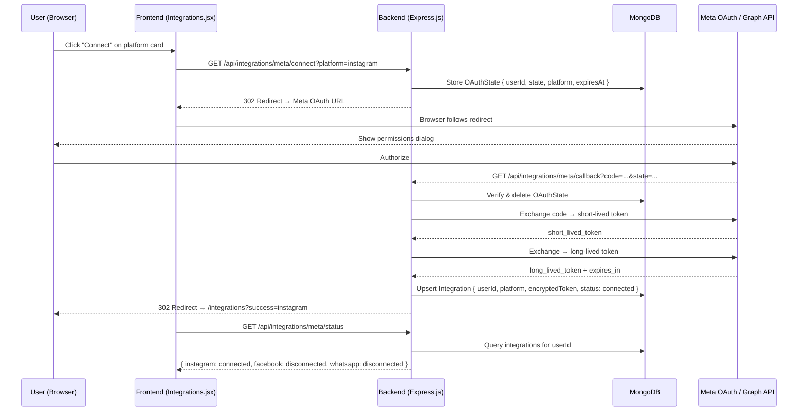

# Design Document: Meta OAuth Integration

## Overview

This feature adds Meta (Facebook/Instagram/WhatsApp) OAuth 2.0 integration to AutoflowPilot. Users connect their Meta platform accounts from the Integrations page, which triggers a server-side OAuth flow. The backend exchanges authorization codes for long-lived access tokens, encrypts them with AES-256, and persists them in MongoDB. The frontend reflects real connection state fetched from the API.

The three supported platforms share a single OAuth flow entry point but differ in requested scopes:
- **Instagram**: `instagram_basic`, `instagram_manage_messages`, `pages_show_list`
- **Facebook (Messenger)**: `pages_messaging`, `pages_show_list`, `pages_manage_metadata`
- **WhatsApp Business**: `whatsapp_business_management`, `whatsapp_business_messaging`

### Key Design Decisions

- **State stored in MongoDB with TTL** (not in-memory or Redis) — consistent with the existing stack, no new infrastructure needed. A TTL index of 10 minutes ensures automatic cleanup.
- **AES-256-GCM** chosen over AES-256-CBC — provides authenticated encryption, preventing ciphertext tampering without a separate HMAC.
- **Long-lived token exchange** happens immediately after the short-lived token is received, so the stored token is always the long-lived one.
- **Upsert on connect** — if a user reconnects a platform, the existing record is updated rather than duplicated.
- **Token never returned to frontend** — the status endpoint returns only platform name, status, and display name.

---

## Architecture



---

## Components and Interfaces

### Backend

#### `backend/models/OAuthState.js`
Temporary CSRF state storage with automatic TTL expiry.

```
OAuthState {
  userId:    ObjectId (ref: User)
  state:     String (unique, indexed)
  platform:  String (enum: instagram | facebook | whatsapp)
  expiresAt: Date (TTL index: 600 seconds)
}
```

#### `backend/models/Integration.js`
Persistent per-user integration record.

```
Integration {
  userId:         ObjectId (ref: User, indexed)
  platform:       String (enum: instagram | facebook | whatsapp)
  encryptedToken: String
  iv:             String  (AES-GCM initialization vector, hex)
  authTag:        String  (AES-GCM authentication tag, hex)
  expiresAt:      Date
  status:         String (enum: connected | disconnected | expired)
  connectedAt:    Date
}
Compound unique index: { userId, platform }
```

#### `backend/routes/integrations.js`

| Method | Path | Auth | Description |
|--------|------|------|-------------|
| GET | `/api/integrations/meta/connect` | Required | Generates state, redirects to Meta OAuth |
| GET | `/api/integrations/meta/callback` | None | Handles Meta redirect, exchanges code, stores token |
| GET | `/api/integrations/meta/status` | Required | Returns connection status for all 3 platforms |
| DELETE | `/api/integrations/meta/:platform` | Required | Disconnects a platform, clears token |

#### `backend/lib/encryption.js`
AES-256-GCM encrypt/decrypt utilities using Node's built-in `crypto` module.

```
encrypt(plaintext: string) → { ciphertext, iv, authTag }
decrypt(ciphertext, iv, authTag) → plaintext
```

The encryption key is derived from `process.env.ENCRYPTION_KEY` (32-byte hex string stored in backend `.env`).

### Frontend

#### `src/lib/api.js` — new `integrations` namespace

```
api.integrations.getStatus()          → GET /api/integrations/meta/status
api.integrations.getConnectUrl(platform) → GET /api/integrations/meta/connect?platform=...
api.integrations.disconnect(platform) → DELETE /api/integrations/meta/:platform
```

#### `src/pages/Integrations.jsx`

Updated to:
1. Fetch real status on mount via `api.integrations.getStatus()`
2. On "Connect" click: call `getConnectUrl(platform)` then redirect `window.location.href`
3. On "Disconnect" click: show existing confirmation modal, then call `disconnect(platform)`
4. On mount: read `?success=` and `?error=` query params and show toast notifications
5. Show a loading skeleton while status is being fetched

---

## Data Models

### OAuthState Schema (Mongoose)

```javascript
const oauthStateSchema = new mongoose.Schema({
  userId:   { type: mongoose.Schema.Types.ObjectId, ref: 'User', required: true },
  state:    { type: String, required: true, unique: true },
  platform: { type: String, enum: ['instagram', 'facebook', 'whatsapp'], required: true },
  expiresAt:{ type: Date, default: () => new Date(Date.now() + 10 * 60 * 1000) }
})
oauthStateSchema.index({ expiresAt: 1 }, { expireAfterSeconds: 0 })
```

### Integration Schema (Mongoose)

```javascript
const integrationSchema = new mongoose.Schema({
  userId:         { type: mongoose.Schema.Types.ObjectId, ref: 'User', required: true, index: true },
  platform:       { type: String, enum: ['instagram', 'facebook', 'whatsapp'], required: true },
  encryptedToken: { type: String },
  iv:             { type: String },
  authTag:        { type: String },
  expiresAt:      { type: Date },
  status:         { type: String, enum: ['connected', 'disconnected', 'expired'], default: 'disconnected' },
  connectedAt:    { type: Date }
})
integrationSchema.index({ userId: 1, platform: 1 }, { unique: true })
```

### Platform Scope Map

```javascript
const PLATFORM_SCOPES = {
  instagram: ['instagram_basic', 'instagram_manage_messages', 'pages_show_list'],
  facebook:  ['pages_messaging', 'pages_show_list', 'pages_manage_metadata'],
  whatsapp:  ['whatsapp_business_management', 'whatsapp_business_messaging']
}
```

### Status Response Shape

```json
{
  "instagram": { "status": "connected", "connectedAt": "2024-01-15T10:00:00Z" },
  "facebook":  { "status": "disconnected", "connectedAt": null },
  "whatsapp":  { "status": "disconnected", "connectedAt": null }
}
```

---

## Correctness Properties

*A property is a characteristic or behavior that should hold true across all valid executions of a system — essentially, a formal statement about what the system should do. Properties serve as the bridge between human-readable specifications and machine-verifiable correctness guarantees.*

### Property 1: OAuth URL contains required parameters for any platform

*For any* valid platform value (`instagram`, `facebook`, `whatsapp`), the constructed OAuth authorization URL SHALL contain `client_id`, `redirect_uri`, `response_type=code`, `state`, and the correct scope string for that platform.

**Validates: Requirements 1.2, 1.3, 6.1, 6.2, 6.3**

---

### Property 2: State parameter round-trip

*For any* platform and cryptographically random state string, encoding the state+platform into the OAuth state parameter and then decoding it SHALL recover both the original state string and the original platform name exactly.

**Validates: Requirements 1.3**

---

### Property 3: State storage and retrieval

*For any* userId and state value, storing an OAuthState document and then querying by that state value SHALL return the same userId and platform that were stored.

**Validates: Requirements 1.4**

---

### Property 4: State invalidation after use

*For any* state parameter that has been verified once (whether verification succeeded or failed), attempting to verify the same state parameter a second time SHALL fail with an invalid/not-found result.

**Validates: Requirements 7.4**

---

### Property 5: State uniqueness

*For any* N ≥ 2 independently generated state parameters, all N values SHALL be distinct, and each SHALL be at least 64 hexadecimal characters (32 bytes of entropy).

**Validates: Requirements 7.3**

---

### Property 6: Token encryption round-trip

*For any* non-empty access token string, `decrypt(encrypt(token))` SHALL return a value equal to the original token, and `encrypt(token)` SHALL NOT equal the original token.

**Validates: Requirements 5.3, 5.4**

---

### Property 7: Integration record upsert (no duplicates)

*For any* userId and platform, calling the connect flow N times (N ≥ 1) SHALL result in exactly one Integration document in MongoDB for that `(userId, platform)` pair.

**Validates: Requirements 5.2**

---

### Property 8: User isolation

*For any* two distinct userIds A and B, querying integrations for userId A SHALL never return any Integration document whose `userId` field equals B.

**Validates: Requirements 5.1**

---

### Property 9: Disconnect clears token and sets status

*For any* Integration record with `status: connected` and a non-null `encryptedToken`, after a successful disconnect operation, the record SHALL have `status: disconnected` and `encryptedToken` SHALL be null or absent.

**Validates: Requirements 4.3**

---

### Property 10: Status endpoint always returns all platforms

*For any* authenticated user (regardless of which platforms are connected), the `GET /api/integrations/meta/status` response SHALL contain entries for all three platforms: `instagram`, `facebook`, and `whatsapp`.

**Validates: Requirements 3.2**

---

### Property 11: Access token never appears in API responses

*For any* Integration record with a non-null `encryptedToken`, the JSON body of any response from any `/api/integrations/*` endpoint SHALL NOT contain the decrypted access token value.

**Validates: Requirements 7.1**

---

### Property 12: UI renders correct controls for any platform status

*For any* platform and its status value (`connected` or `disconnected`), the rendered Integrations page SHALL display a "Connected" badge and "Disconnect" button when status is `connected`, and a "Not Connected" badge and "Connect" button when status is `disconnected` or absent.

**Validates: Requirements 3.3, 3.4**

---

## Error Handling

| Scenario | Backend Behavior | Frontend Behavior |
|----------|-----------------|-------------------|
| Unauthenticated connect request | 401 JSON response | Redirect to `/login` |
| Invalid/expired state on callback | 400 JSON, no token exchange | — |
| Meta returns error on callback | Log error, redirect to `/integrations?error=<reason>` | Show error toast |
| User denies permissions | Meta sends `error=access_denied` to callback, redirect with error | Show error toast |
| Token exchange fails | Log error, redirect with `error=token_exchange_failed` | Show error toast |
| Long-lived token exchange fails | Log error, redirect with `error=token_exchange_failed` | Show error toast |
| Disconnect on non-existent record | 404 JSON | Show error toast, status unchanged |
| Token within 7 days of expiry | Attempt refresh; on failure set status `expired` | Show "Reconnect" prompt |
| Encryption key missing from env | Server startup error logged, 500 on affected routes | Generic error toast |

All backend errors follow the existing pattern from `auth.js`:
```javascript
res.status(500).json({ message: 'Server error' })
```

Callback errors that cannot return JSON (because Meta expects a redirect) use:
```
302 → https://autoflow-ecru.vercel.app/integrations?error=<encoded_reason>
```

---

## Testing Strategy

### Unit Tests

Focus on pure functions and isolated logic:

- `encryption.js`: encrypt/decrypt round-trips with various token lengths and character sets
- URL construction: verify all required query params are present for each platform
- State encoding/decoding: verify round-trip fidelity
- Scope map: verify correct scopes returned for each platform
- Token expiry check: verify 7-day threshold logic (boundary: 6 days → refresh, 8 days → no refresh)

### Property-Based Tests

Using **fast-check** (JavaScript PBT library) with minimum **100 iterations** per property.

Each test is tagged with:
```
// Feature: meta-oauth-integration, Property N: <property_text>
```

Properties to implement as PBT:

| Property | fast-check Arbitraries |
|----------|----------------------|
| P1: OAuth URL params | `fc.constantFrom('instagram','facebook','whatsapp')` |
| P2: State round-trip | `fc.string()`, `fc.constantFrom(platforms)` |
| P3: State storage/retrieval | `fc.uuid()`, `fc.hexaString({minLength:64,maxLength:64})` |
| P4: State invalidation | `fc.hexaString({minLength:64})` |
| P5: State uniqueness | `fc.integer({min:2,max:20})` for N |
| P6: Token encryption round-trip | `fc.string({minLength:1})` |
| P7: Upsert no duplicates | `fc.uuid()`, `fc.constantFrom(platforms)`, `fc.integer({min:1,max:5})` for N |
| P8: User isolation | `fc.uuid()`, `fc.uuid()` (distinct pair) |
| P9: Disconnect clears token | `fc.uuid()`, `fc.constantFrom(platforms)` |
| P10: Status always returns all platforms | `fc.uuid()`, `fc.subarray(platforms)` for connected subset |
| P11: Token not in response | `fc.string({minLength:20})` for token value |
| P12: UI renders correct controls | `fc.constantFrom('connected','disconnected',null)` |

### Integration Tests

- Full OAuth callback flow with mocked Meta API responses (valid code, invalid code, denied permissions)
- Disconnect flow end-to-end
- Status endpoint with mixed connection states
- Token refresh trigger (mock token with expiry within 7 days)

### Example-Based Tests

- Unauthenticated request to `/connect` returns 401
- Callback with mismatched state returns 400
- Callback with Meta error redirects with `?error=`
- Success callback redirects with `?success=<platform>`
- Frontend shows success toast when `?success=instagram` is in URL
- Frontend shows error toast when `?error=` is in URL
- Disconnect confirmation modal appears before API call
