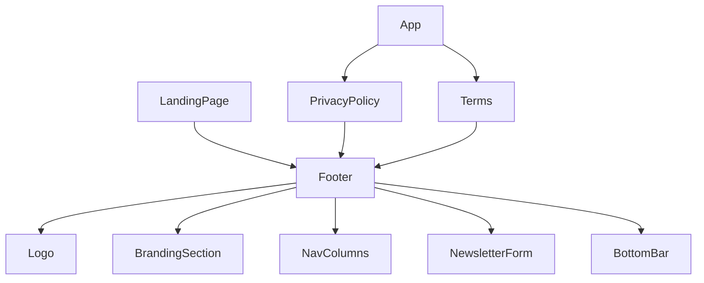

# Design Document: Website Footer

## Overview

This document describes the technical design for replacing Aotuflow's minimal `Footer.jsx` with a full marketing footer. The new footer follows the Meta/Notion/Linear SaaS pattern: a multi-column layout with branding + social icons on the left, three navigation columns (Product, Company, Legal), a newsletter signup form, and a bottom bar with copyright and legal links.

Two new pages — Privacy Policy (`/privacy`) and Terms of Service (`/terms`) — are also introduced, along with the corresponding route registrations in `App.jsx`.

The design must stay within the existing stack: **React + Vite**, **Tailwind CSS**, **React Router v6**, and the project's dark theme (`#060d1a` background, glass morphism, blue/purple gradients).

---

## Architecture

The feature touches four files and creates three new ones:

```
src/
  components/
    Footer.jsx              ← replaced (same path, no import changes needed)
  pages/
    PrivacyPolicy.jsx       ← new
    Terms.jsx               ← new
  App.jsx                   ← add /privacy and /terms routes
```

The footer is a **pure presentational component** with one small piece of local state: the newsletter form (email value, success flag, error flag). No global state, no context, no external data fetching at render time. The newsletter subscription is a fire-and-forget `fetch` call; the component handles its own loading/success/error states internally.



---

## Components and Interfaces

### `Footer` (replaces `src/components/Footer.jsx`)

**Props:** none  
**State:**
- `email: string` — controlled input value
- `status: 'idle' | 'success' | 'error'` — newsletter submission state

**Sections rendered:**

| Section | Description |
|---|---|
| `BrandingSection` | Logo (size="sm"), tagline, five social icon links |
| `NavColumns` | Three `<ul>` groups: Product, Company, Legal |
| `NewsletterForm` | `<form>` with email `<input>` and Subscribe `<button>` |
| `BottomBar` | Copyright year + Privacy Policy / Terms links |

All sections are co-located inside `Footer.jsx` as inline JSX (no separate files needed — the component is self-contained and not reused in pieces).

### Social Icon Data

Defined as a static array inside `Footer.jsx`:

```js
const SOCIAL_LINKS = [
  { label: 'Instagram', href: 'https://instagram.com/aotuflow', Icon: InstagramIcon },
  { label: 'Facebook',  href: 'https://facebook.com/aotuflow',  Icon: FacebookIcon  },
  { label: 'Twitter/X', href: 'https://twitter.com/aotuflow',   Icon: TwitterIcon   },
  { label: 'LinkedIn',  href: 'https://linkedin.com/company/aotuflow', Icon: LinkedInIcon },
  { label: 'YouTube',   href: 'https://youtube.com/@aotuflow',  Icon: YouTubeIcon   },
]
```

Social icons are rendered as inline SVGs (no external icon library dependency needed — the project already uses `lucide-react` but lucide does not include all five required brand icons). Simple SVG paths for each brand icon will be inlined.

### Navigation Column Data

```js
const NAV_COLUMNS = [
  {
    heading: 'Product',
    links: [
      { label: 'Features',     href: '/#features',    external: false },
      { label: 'Pricing',      href: '/#pricing',     external: false },
      { label: 'Integrations', href: '/app/integrations', external: false },
      { label: 'Changelog',    href: '#',             external: false },
    ],
  },
  {
    heading: 'Company',
    links: [
      { label: 'About',    href: '#',                        external: false },
      { label: 'Blog',     href: '#',                        external: false },
      { label: 'Careers',  href: '#',                        external: false },
      { label: 'Contact',  href: 'mailto:support@aotuflow.com', external: true },
    ],
  },
  {
    heading: 'Legal',
    links: [
      { label: 'Privacy Policy',    href: '/privacy', external: false },
      { label: 'Terms of Service',  href: '/terms',   external: false },
      { label: 'Cookie Policy',     href: '#',        external: false },
    ],
  },
]
```

Internal routes (`external: false`) use React Router `<Link to={href}>`. External URLs (`external: true`) use `<a href={href} target="_blank" rel="noopener noreferrer">`.

### `PrivacyPolicy` (`src/pages/PrivacyPolicy.jsx`)

Standalone page component. Renders a full-width dark-themed document with:
- Page header: "Privacy Policy" heading + last-updated date
- Sections: Data Collection, Data Usage, Cookies, Third-Party Services, User Rights
- `<Footer />` at the bottom

### `Terms` (`src/pages/Terms.jsx`)

Same structure as `PrivacyPolicy` with:
- Page header: "Terms of Service" heading + last-updated date
- Sections: Acceptance of Terms, Use of Service, Prohibited Activities, Intellectual Property, Limitation of Liability
- `<Footer />` at the bottom

---

## Data Models

### Newsletter Form State

```ts
type NewsletterStatus = 'idle' | 'success' | 'error'

interface NewsletterState {
  email: string          // controlled input value
  status: NewsletterStatus
}
```

State transitions:
- `idle` → `success`: valid email submitted, fetch resolves (or no backend — optimistic success)
- `idle` → `error`: fetch rejects / network error
- `success` → `idle`: after 3000ms timeout (via `setTimeout`)
- `error` → `idle`: user edits the input field

Since there is no newsletter backend endpoint yet, the form will use an **optimistic success** pattern: on submit with a valid email, immediately transition to `success` and clear the input. If a real endpoint is wired up later, the `fetch` call replaces the optimistic path.

### Route Registration

Two new lazy-loaded routes added to `App.jsx`:

```jsx
const PrivacyPolicy = lazy(() => import('./pages/PrivacyPolicy'))
const Terms         = lazy(() => import('./pages/Terms'))

// Inside <Routes>:
<Route path="/privacy" element={<PrivacyPolicy />} />
<Route path="/terms"   element={<Terms />} />
```

These routes are public (no auth guard) and sit alongside the existing `/` route.

---

## Layout Design

### Desktop (≥ 768px) — Grid Layout

```
┌─────────────────────────────────────────────────────────────┐
│  [Logo + Tagline]   [Product]   [Company]   [Legal]   [Newsletter] │
│  [Social Icons]     links...    links...    links...  [input][btn]  │
├─────────────────────────────────────────────────────────────┤
│  © 2025 Aotuflow. All rights reserved.    Privacy · Terms   │
└─────────────────────────────────────────────────────────────┘
```

Tailwind grid: `grid grid-cols-1 md:grid-cols-5 gap-8` — branding takes 2 cols, each nav column takes 1 col, newsletter takes 1 col. On smaller md screens this may wrap; a `lg:grid-cols-5` variant ensures the 5-column layout only kicks in at 1024px+ while md uses a 2-column wrap.

Revised approach for cleaner responsive behavior:
- **Mobile** (`< md`): single column stack
- **Tablet** (`md`): 2-column grid (branding + newsletter top row, nav columns below)
- **Desktop** (`lg`): 5-column grid as described above

### Mobile (< 768px) — Stacked Layout

```
[Logo + Tagline]
[Social Icons]
[Product links]
[Company links]
[Legal links]
[Newsletter form]
─────────────────
[Copyright]
[Privacy · Terms]
```

---

## Visual Design

### Color and Theming

| Element | Tailwind Classes |
|---|---|
| Footer root | `border-t border-white/10 bg-[#060d1a]` |
| Section headings | `text-white font-semibold text-sm uppercase tracking-wider` |
| Nav links | `text-gray-400 hover:text-white transition-colors duration-200` |
| Social icons | `text-gray-400 hover:text-white transition-colors duration-200` |
| Newsletter input | `bg-white/5 border border-white/10 backdrop-blur-xl text-white placeholder-gray-500 rounded-lg` |
| Subscribe button | Existing `Button` component with `variant="primary"` |
| Bottom bar | `border-t border-white/10 text-gray-500 text-xs` |
| Tagline | `text-gray-400 text-sm` |

### Newsletter Form Layout

```
┌─────────────────────────────────┐
│  Stay in the loop               │
│  [email input field           ] │
│  [Subscribe button            ] │
│  "Thanks for subscribing!" ✓    │  ← success state
└─────────────────────────────────┘
```

Input and button stack vertically on mobile, remain stacked on desktop within the newsletter column (narrow column width makes side-by-side impractical).

---

## Correctness Properties

*A property is a characteristic or behavior that should hold true across all valid executions of a system — essentially, a formal statement about what the system should do. Properties serve as the bridge between human-readable specifications and machine-verifiable correctness guarantees.*

### Property 1: Social icons open in new tab with safe attributes

*For any* social icon rendered in the footer, it SHALL have a non-empty `href`, `target="_blank"`, and `rel="noopener noreferrer"` attributes.

**Validates: Requirements 2.4**

### Property 2: All social icons have descriptive aria-labels

*For any* social icon rendered in the footer, it SHALL have a non-empty `aria-label` attribute that describes the platform (e.g., "Follow us on Instagram").

**Validates: Requirements 8.3**

### Property 3: Internal links use React Router Link, external links use anchor tags

*For any* link in the footer that points to an internal route (href starts with `/` and is not a full URL), it SHALL be rendered as a React Router `<Link>` component. *For any* link that points to an external URL (starts with `http://` or `https://` or `mailto:`), it SHALL be rendered as a plain `<a>` tag.

**Validates: Requirements 3.6**

### Property 4: Valid email submission clears input and shows success

*For any* valid email address string (matches the HTML5 email pattern), submitting the newsletter form SHALL result in the email input being cleared and the success message "Thanks for subscribing!" being displayed.

**Validates: Requirements 4.5**

### Property 5: All interactive footer elements are keyboard-accessible

*For any* interactive element (links, buttons, inputs) rendered inside the footer, it SHALL be reachable via keyboard Tab navigation — meaning it is either a naturally focusable HTML element (`<a>`, `<button>`, `<input>`) or has an explicit non-negative `tabIndex`.

**Validates: Requirements 8.5**

---

## Error Handling

### Newsletter Form

| Scenario | Behavior |
|---|---|
| Empty input submitted | HTML5 `required` + `type="email"` prevents submission natively |
| Invalid email format | HTML5 `type="email"` validation blocks submission |
| Valid email, no backend | Optimistic success: clear input, show "Thanks for subscribing!" |
| Valid email, fetch error | Catch block sets `status = 'error'`, shows "Something went wrong. Please try again." |
| Success message timeout | `setTimeout(3000)` resets `status` to `'idle'`; cleanup via `useEffect` return to avoid memory leaks if component unmounts |

### Route Handling

The `*` catch-all route in `App.jsx` redirects to `/`. The new `/privacy` and `/terms` routes are registered before the catch-all, so they will match correctly.

### Social Link Failures

Social links are static `<a>` tags. No error handling needed — broken links are a content concern, not a runtime error.

---

## Testing Strategy

### Unit Tests (Example-Based)

These cover specific rendering and behavior checks:

- Footer renders `<footer>` as root element (Req 8.1)
- Footer contains `<nav aria-label="Footer navigation">` (Req 8.2)
- Branding section renders Logo with `size="sm"` (Req 2.1)
- Tagline "Automate your growth." is present (Req 2.2)
- All five social icons are rendered (Req 2.3)
- All three nav column headings are present: Product, Company, Legal (Req 3.1)
- Product column contains all four expected links (Req 3.2)
- Company column contains all four expected links (Req 3.3)
- Legal column contains Privacy Policy and Terms of Service links with correct routes (Req 3.4)
- Newsletter heading "Stay in the loop" is present (Req 4.1)
- Email input has `placeholder="Enter your email"` and `type="email"` and `required` (Req 4.2, 4.4)
- Subscribe button is present (Req 4.3)
- Email input has `aria-label="Email address for newsletter"` (Req 8.4)
- Success message disappears after 3000ms (Req 4.6) — use `vi.useFakeTimers()`
- Error message shown on network failure (Req 4.7)
- Bottom bar shows current year in copyright text (Req 5.1)
- Bottom bar has Privacy Policy and Terms links (Req 5.2)
- PrivacyPolicy page renders heading and all required sections (Req 6.3)
- Terms page renders heading and all required sections (Req 6.4)

### Property-Based Tests

Property-based testing is applicable here because several requirements express universal rules that should hold across all instances of a set (all social icons, all interactive elements, all valid emails). The project uses **Vitest** as the test runner; the recommended PBT library is **[fast-check](https://github.com/dubzzz/fast-check)** (well-maintained, works with Vitest, no additional setup beyond `npm install fast-check`).

Each property test runs a minimum of **100 iterations**.

| Property | Test Description |
|---|---|
| Property 1 | For each of the 5 social icons, assert `href`, `target`, `rel` attributes |
| Property 2 | For each of the 5 social icons, assert non-empty `aria-label` |
| Property 3 | For each nav link, assert correct element type based on href pattern |
| Property 4 | `fc.emailAddress()` generator → submit form → assert cleared input + success message |
| Property 5 | For each interactive element in footer, assert it is a focusable element type |

Tag format for property tests:
```
// Feature: website-footer, Property 1: Social icons open in new tab with safe attributes
// Feature: website-footer, Property 4: Valid email submission clears input and shows success
```

### Smoke Tests

- Footer root element has `border-t border-white/10` class (Req 7.3)
- Nav links have `transition-colors duration-200` and `hover:text-white` classes (Req 3.5, 7.4)
- Newsletter input has glass style classes (Req 7.5)
- `/privacy` and `/terms` routes are defined in App.jsx (Req 6.1, 6.2)

### Test File Location

```
src/tests/
  footer.test.jsx        ← unit + property tests for Footer component
  privacyPolicy.test.jsx ← unit tests for PrivacyPolicy page
  terms.test.jsx         ← unit tests for Terms page
```
